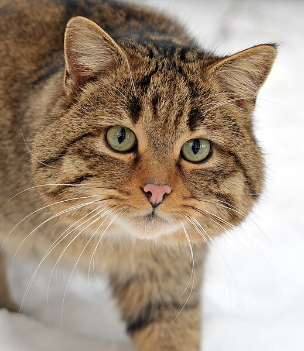

# MIME-type examples {#MIME-type-examples}

This file tests the output for all available MIME-types.

```julia
"""
    MediaOutput{MIME"..."}(contents::String)

A struct representing media output with a specific MIME type.

# Fields
- `contents::String`: The contents of the media output.
"""
struct MediaOutput{MimeType}
    contents::Vector{UInt8}
end
MediaOutput{MimeType}(contents::String) where MimeType = MediaOutput{MimeType}(Vector{UInt8}(contents))
# This defines the show method for the target MIME type only!
Base.show(io, ::MimeType, media::MediaOutput{MimeType}) where MimeType = write(io, media.contents)
# MediaOutput{MIME"text/plain"}("Hello there!")
```


```julia
using DocumenterVitepress
MediaOutput{MIME"image/png"}(read(joinpath(pathof(DocumenterVitepress) |> dirname |> dirname, "docs", "src", "assets", "logo.png")))
```


```julia
MediaOutput{MIME"image/jpeg"}(read(download("https://upload.wikimedia.org/wikipedia/commons/thumb/0/0e/Felis_silvestris_silvestris.jpg/519px-Felis_silvestris_silvestris.jpg")))
```



Vite automatically inlines assets under 4KB by default, if this causes issues with your SVG files you can disable this behavior by adding the following to your vitepress configuration:

::: info config.mts

```
vite: {
    build: {
        assetsInlineLimit: 0, // so we can tell whether we have created inlined images or not, we don't let vite inline them
    }
},
```


:::

```julia
MediaOutput{MIME"image/svg+xml"}("https://upload.wikimedia.org/wikipedia/commons/6/6c/SVG_Simple_Icon.svg" |> download |> read)
```


```julia
MediaOutput{MIME"image/gif"}(read(download("https://upload.wikimedia.org/wikipedia/commons/2/2c/Rotating_earth_%28large%29.gif")))
```


